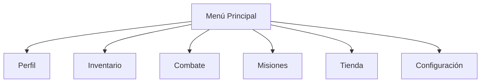
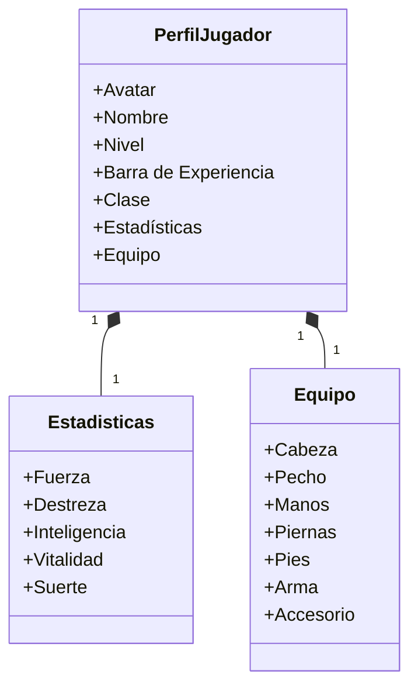
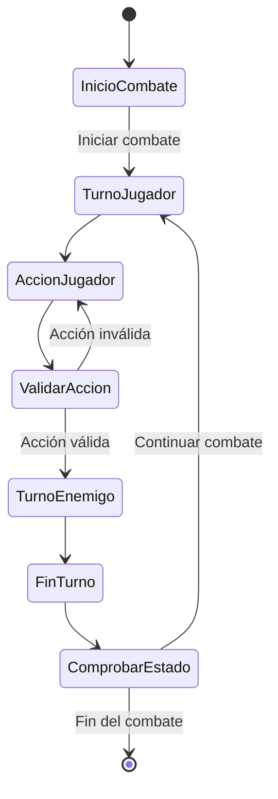
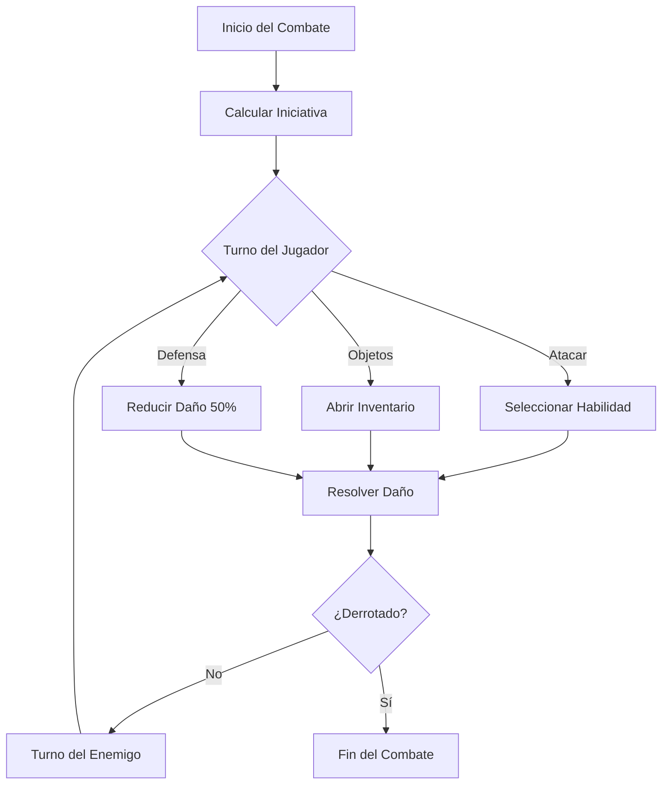
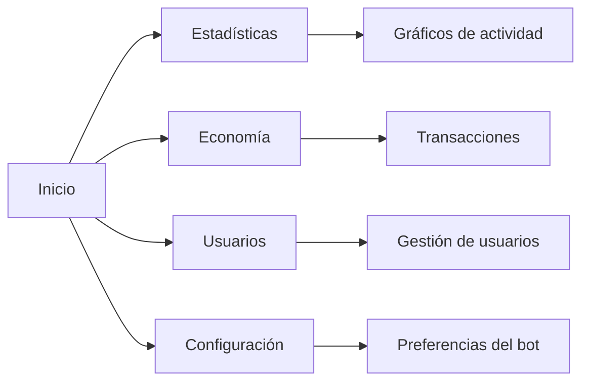
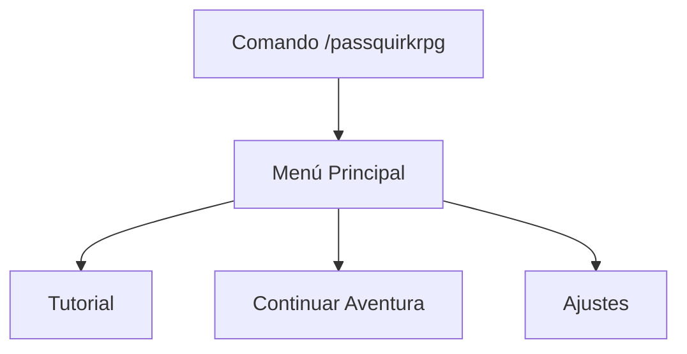
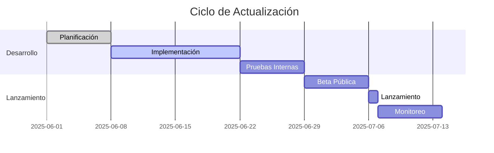
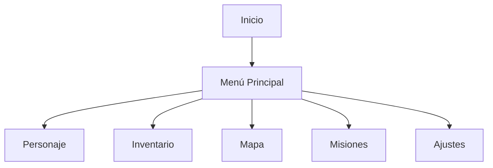

# 🎨 Diseño - PassQuirk RPG

## 🌟 Visión General

PassQuirk RPG es un bot de Discord que combina elementos de RPG clásico con mecánicas modernas de juego. Este documento detalla el diseño visual y la experiencia de usuario del bot, incluyendo referencias de diseño, paletas de colores y componentes de interfaz.

## 🖼️ Referencias de Diseño

### Inspiración Principal
- **Interfaz de Diálogo**: Inspirada en juegos RPG clásicos con un toque moderno
- **Sistema de Combate**: Combina elementos de juegos por turnos con mecánicas estratégicas
- **Diseño de Personajes**: Estilo anime/manga con proporciones estilizadas
- **Interfaz de Usuario**: Inspirada en juegos móviles modernos con elementos táctiles claros
- **Navegación**: Diseño intuitivo con acceso rápido a las funciones principales

### Elementos Clave
- **Tarjetas de Diálogo**: Diseño limpio con bordes redondeados y sombras sutiles
- **Barras de Estado**: Visualización clara de salud, maná y experiencia
- **Menús Contextuales**: Navegación intuitiva con iconos reconocibles
- **Botones de Acción**: Diseño táctil con retroalimentación visual
- **Transiciones Suaves**: Animaciones sutiles para mejorar la experiencia de usuario

## 🖥️ Diseño de la Interfaz Principal

### 1. Menú Principal


### 2. Tarjeta de Perfil del Jugador


### 3. Diseño de la Interfaz de Combate


### 4. Paleta de Colores Actualizada

| Tipo | Código | Uso |
|------|--------|-----|
| Fondo Principal | `#0F172A` | Fondo de la aplicación |
| Fondo Secundario | `#1E293B` | Paneles y tarjetas |
| Borde | `#334155` | Líneas divisorias |
| Texto Primario | `#F8FAFC` | Texto principal |
| Texto Secundario | `#94A3B8` | Texto secundario |
| Éxito | `#10B981` | Acciones exitosas |
| Peligro | `#EF4444` | Errores y advertencias |
| Advertencia | `#F59E0B` | Advertencias |
| Info | `#3B82F6` | Información importante |
| Premium | `#A855F7` | Elementos premium |

### 5. Componentes de la Interfaz

#### 5.1 Barra de Navegación Superior
- Logo de PassQuirk a la izquierda
- Menú desplegable con opciones principales
- Icono de notificaciones
- Avatar del jugador con menú desplegable

#### 5.2 Tarjeta de Personaje
```javascript
{
  "nombre": "Nombre del Personaje",
  "nivel": 1,
  "clase": "Guerrero",
  "vida": {
    "actual": 100,
    "maxima": 100
  },
  "mana": {
    "actual": 50,
    "maximo": 50
  },
  "experiencia": {
    "actual": 0,
    "siguienteNivel": 1000
  },
  "estadisticas": {
    "fuerza": 10,
    "destreza": 8,
    "inteligencia": 5,
    "vitalidad": 12,
    "suerte": 7
  }
}
```

#### 5.3 Menú de Acción Rápida
- Botones grandes para acciones principales
- Iconos intuitivos
- Contador de notificaciones
- Efectos al pasar el ratón

### 6. Diseño Responsivo
- Adaptable a diferentes tamaños de pantalla
- Menú colapsable en móviles
- Botones de tamaño táctil
- Tipografía legible en todos los dispositivos

## 🎨 Paleta de Colores de PassQuirk

### Colores Principales
| Color | Código | Uso Principal |
|-------|--------|---------------|
| Azul Principal | `#3B82F6` | Botones principales, acentos |
| Azul Oscuro | `#1E40AF` | Encabezados, botones secundarios |
| Dorado | `#F59E0B` | Elementos premium, recompensas |

### Colores de Interfaz
| Color | Código | Uso Principal |
|-------|--------|---------------|
| Fondo Oscuro | `#0F172A` | Fondo principal de la aplicación |
| Fondo Tarjetas | `#1E293B` | Tarjetas y contenedores |
| Texto Principal | `#F8FAFC` | Texto en fondos oscuros |
| Texto Secundario | `#94A3B8` | Texto menos importante |

## 🛠️ Componentes de Interfaz

### 1. Sistema de Embeds

#### Estructura Básica
```javascript
{
  color: '#3B82F6',
  title: 'Título del Embed',
  description: 'Descripción detallada',
  fields: [
    { name: 'Campo 1', value: 'Valor 1', inline: true },
    { name: 'Campo 2', value: 'Valor 2', inline: true }
  ],
  thumbnail: { url: 'url_imagen' },
  footer: { text: 'PassQuirk RPG • 2025' }
}
```

#### Tipos de Embeds
1. **Información**: Azul (#3B82F6)
2. **Éxito**: Verde (#10B981)
3. **Advertencia**: Amarillo (#F59E0B)
4. **Error**: Rojo (#EF4444)
5. **Premium**: Dorado (#F59E0B)

### 2. Componentes Interactivos

#### Botones
- **Primario**: Azul (#3B82F6) - Acciones principales
- **Secundario**: Gris (#4B5563) - Acciones secundarias
- **Éxito**: Verde (#10B981) - Confirmaciones
- **Peligro**: Rojo (#EF4444) - Eliminar/cancelar
- **Premium**: Dorado (#F59E0B) - Acciones premium

#### Menús Desplegables
- Máximo 25 opciones por menú
- Agrupación lógica de opciones
- Búsqueda integrada para listas largas

## 🎮 Interfaz de Juego

### 1. Menú Principal
// (ciomaff) Me gustar
```
┌─────────────────────────────────────────────┐
│  PASQUIRK RPG - MENÚ PRINCIPAL             │
├─────────────────────────────────────────────┤
│  👤 Perfil       🏆 Misiones    🏪 Tienda  │
│  ⚔️ Combate      🎒 Inventario   🏛️ Gremio  │
│  🗺️ Mapa         🎮 Ajustes     ❓ Ayuda   │
└─────────────────────────────────────────────┘
```

### 2. Sistema de Combate
```
┌─────────────────────────────────────────────┐
│  ⚔️ COMBATE - TURNO #3                     │
├─────────────────────────────────────────────┤
│  ENEMIGO: Guerrero Esqueleto [Lv. 12]      │
│  ❤️ ██████████░░░░░░░░░░ 120/200          │
│                                           │
│  TUS ACCIONES:                            │
│  [1] Atacar    [2] Habilidades            │
│  [3] Objetos   [4] Defensa                │
└─────────────────────────────────────────────┘
```

### 3. Perfil de Jugador
```
┌─────────────────────────────────────────────┐
│  👤 NOMBRE_DEL_JUGADOR [Lv. 25]           │
├─────────────────────────────────────────────┤
│  Clase: Guerrero        Rango: Héroe       │
│  ❤️ Salud: 150/200    ✨ Exp: 1,250/2,000  │
│  ⚡ Energía: 45/100   💰 Oro: 12,450       │
│                                           │
│  ESTADÍSTICAS:                            │
│  ⚔️ Ataque: 45      🛡️ Defensa: 30        │
│  ⚡ Velocidad: 55    🍀 Suerte: 20         │
└─────────────────────────────────────────────┘
```

## 🎨 Guía de Estilo

### Tipografía
- **Títulos**: `Poppins` (700) - Para encabezados
- **Texto Normal**: `Roboto` (400) - Para cuerpo de texto
- **Código/Monoespaciado**: `Fira Code` - Para código y datos

### Iconografía
- **Estilo**: Línea delgada (2px)
- **Tamaño**: 24x24px para botones, 16x16px para texto
- **Conjunto**: Material Icons + Game Icons

### Espaciado
- **Base**: 4px
- **Contenedores**: 16px de padding
- **Elementos**: 8px de margen

## 📱 Diseño Responsivo

### Desktop
- Máximo ancho de contenido: 1200px
- 2-3 columnas en grid
- Menú lateral colapsable

### Móvil
- Una columna
- Menú inferior fijo
- Botones grandes para tocar

## 🎮 Referencias Visuales

### 1. Diálogos NPC
```
┌─────────────────────────────────────────────┐
│  🧙‍♂️ VIEJO SABIO                         │
├─────────────────────────────────────────────┤
│  ¡Bienvenido, aventurero! El reino te      │
│  necesita en estos tiempos oscuros. ¿Estás │
│  listo para embarcarte en esta aventura?   │
├─────────────────────────────────────────────┤
│  [1] ¡Por supuesto!                        │
│  [2] Cuéntame más sobre la amenaza        │
│  [3] ¿Qué recompensa hay?                 │
└─────────────────────────────────────────────┘
```

### 2. Tienda
```
┌─────────────── PASQUIRK TIENDA ────────────┐
│  💰 Tienes: 1,250 monedas                  │
├───────────────┬───────────┬───────────────┤
│ [1] Poción Vida  │ [2] Poción Maná │ [3] Antídoto  │
│   50 monedas  │   75 monedas   │   30 monedas   │
├───────────────┼───────────┼───────────────┤
│ [4] Atk Boost │ [5] Def Boost  │ [6] Vel Boost  │
│  120 monedas  │  120 monedas   │  120 monedas   │
└───────────────┴───────────┴───────────────┘
```

## 📋 Tareas Pendientes

### Para CIOMAFF

#### Sistema de Economía
- [ ] Definir tasas de ganancia por actividades
- [ ] Crear tablas de precios de objetos
- [ ] Diseñar sistema de impuestos y comercio

#### Historia y NPCs
- [ ] Escribir arcos argumentales principales
- [ ] Crear diálogos para NPCs clave
- [ ] Desarrollar trasfondos de facciones

#### Desarrollo de PassQuirk
- [ ] Completar sistema de combate
- [ ] Implementar sistema de misiones
- [ ] Desarrollar sistema de gremios

#### Sistema de Lucha
- [ ] Balancear estadísticas de enemigos
- [ ] Implementar efectos de estado
- [ ] Crear habilidades únicas por clase

#### Diseño Visual
- [ ] Crear sprites de personajes
- [ ] Diseñar fondos de batalla
- [ ] Producir efectos visuales

#### Documentación
- [ ] Completar guía de usuario
- [ ] Documentar comandos del bot
- [ ] Crear tutoriales en video

## 🚀 Próximos Pasos

1. **Fase de Prototipado**
   - Implementar sistema básico de combate
   - Crear 3-5 misiones de ejemplo
   - Diseñar interfaz de inventario

2. **Fase de Pruebas**
   - Pruebas internas de jugabilidad
   - Balanceo de economía
   - Optimización de rendimiento

3. **Lanzamiento Beta**
   - Lanzamiento para probadores cerrados
   - Recopilación de feedback
   - Ajustes finales

4. **Lanzamiento Público**
   - Lanzamiento oficial
   - Soporte continuo
   - Actualizaciones periódicas

PassQuirk RPG es un bot de Discord que sumerge a los jugadores en un mundo de fantasía con combates por turnos, exploración y una economía dinámica. Este documento detalla el diseño visual y la experiencia de usuario del bot.

## 🎨 Paleta de Colores de PassQuirk

### Colores Principales
| Color | Código | Uso Principal |
|-------|--------|---------------|
| Amarillo PassQuirk | `#FFD700` | Botones principales, acentos, elementos destacados |
| Azul Claro Oscuro | `#4682B4` | Fondo de secciones, barras de progreso |
| Azul Marino | `#1E3A8A` | Encabezados, botones secundarios |

### Colores de Interfaz
| Color | Código | Uso Principal |
|-------|--------|---------------|
| Fondo Oscuro | `#0F172A` | Fondo principal de la aplicación |
| Fondo Tarjetas | `1E293B` | Tarjetas y contenedores |
| Texto Principal | `#F8FAFC` | Texto en fondos oscuros |
| Texto Secundario | `#94A3B8` | Texto menos importante |

### Colores de Estado
| Color | Código | Uso Principal |
|-------|--------|---------------|
| Éxito | `#10B981` | Confirmaciones, acciones exitosas |
| Advertencia | `#F59E0B` | Advertencias, atención necesaria |
| Peligro | `#EF4444` | Errores, acciones peligrosas |
| Información | `#3B82F6` | Mensajes informativos |

### Degradados Especiales
| Nombre | Código | Uso Principal |
|--------|--------|---------------|
| Dorado Brillante | `linear-gradient(135deg, #FFD700, #FFA500)` | Botones premium, elementos épicos |
| Azul Profundo | `linear-gradient(135deg, #1E3A8A, #3B82F6)` | Encabezados importantes |
| Noche Estrellada | `linear-gradient(135deg, #0F172A, #1E293B)` | Fondos de pantalla |

## 🖼️ Interfaz de Usuario

### 1. Menú Principal


- **Diseño**: Tarjeta de Discord con botones de navegación
- **Elementos**:
  - Avatar del personaje
  - Barra de nivel y experiencia
  - Botones de acciones principales
  - Indicador de energía/estamina

### 2. Combate


- **Diseño**: Interfaz de combate por turnos
- **Elementos**:
  - Sprites de personajes y enemigos
  - Barra de vida/mana
  - Menú de acciones (Atacar, Habilidades, Objetos, Huir)
  - Log de combate

### 3. Inventario


- **Diseño**: Grid de objetos con categorías
- **Elementos**:
  - Filtros por tipo (Armas, Armaduras, Consumibles)
  - Información detallada al seleccionar
  - Opciones de uso/equipar

## 🎮 Mecánicas de Juego

### 1. Sistema de Combate



### 2. Progresión de Personaje

| Nivel | Experiencia Requerida | Recompensas |
|-------|----------------------|-------------|
| 1-10  | 1000 * nivel         | 1 punto de estadística |
| 11-20 | 2500 * nivel         | 1 punto de estadística + habilidad |
| 21-30 | 5000 * nivel         | 2 puntos de estadística + mejora de habilidad |

## 🏦 Sistema Económico (Inspirado en UnbelievaBoat)

### 1. Monedas

- **PassCoins (PC)**: Moneda principal
- **Gemas (G)**: Moneda premium
- **Puntos de Gremio (PG)**: Para mejoras de gremio

### 2. Fuentes de Ingresos

- **Misiones**: 100-1000 PC
- **Combate**: 50-500 PC por victoria
- **Comercio**: Venta de objetos
- **Eventos**: Recompensas especiales

## 🎵 Sistema de Música

### 1. Listas de Reproducción

| Situación | Tipo de Música | Efecto |
|-----------|----------------|--------|
| Exploración | Música ambiental relajante | +5% a encontrar objetos raros |
| Combate | Música épica intensa | +3% de daño |
| Ciudad | Música alegre y animada | Regeneración de vida +1% |
| Jefe | Música orquestal épica | +10% de experiencia |

### 2. Comandos de Música

- `/play [tipo]`: Reproduce música según la situación
- `/music volume [1-100]`: Ajusta el volumen
- `/music toggle`: Activa/desactiva la música

## 🖥️ Panel de Control Web

### 1. Dashboard Principal



### 2. Gestión de Economía

- Ajuste de tasas de ganancia
- Control de precios en la tienda
- Eventos económicos especiales
- Recompensas personalizables

## 🎨 Elementos Visuales

### 1. Cartas de Personaje

```
┌─────────────────────────────┐
│  NOMBRE DEL PERSONAJE      │
├─────────────────────────────┤
│  Nivel: 25      Clase: Mago │
│  Vida: 150/200   Mana: 80/120 │
├─────────────────────────────┤
│  ⚔️ Ataque: 45              │
│  🛡️ Defensa: 30             │
│  ⚡ Velocidad: 55           │
└─────────────────────────────┘
```

### 2. Barras de Progreso

```
Salud: [██████████░░] 75%
Mana:  [████░░░░░░░░] 25%
Exp:   [████████░░░░] 60%
```

## 📱 Diseño Responsivo

### 1. Desktop
- Diseño de dos columnas
- Menú lateral expandible
- Paneles de información detallados

### 2. Móvil
- Menú hamburguesa
- Contenido en una columna
- Botones grandes para tocar

## 🎮 Ejemplo de Flujo de Juego

1. **Inicio de Sesión**
   - El jugador usa `/start`
   - Selecciona clase y personalización

2. **Exploración**
   - Usa `/explorar` para encontrar ubicaciones
   - Encuentra enemigos o tesoros

3. **Combate**
   - Sistema de turnos con habilidades únicas
   - Recompensas al ganar

4. **Progresión**
   - Subida de nivel
   - Mejora de equipo
   - Aprendizaje de habilidades

## 🛠️ Herramientas de Desarrollo

1. **Diseño**
   - Figma para prototipos
   - Aseprite para sprites
   - Adobe Color para paletas

2. **Desarrollo**
   - Node.js con Discord.js
   - MongoDB para base de datos
   - Heroku/AWS para hosting

## 📅 Hoja de Ruta

### Fase 1: MVP
- [ ] Sistema básico de combate
- [ ] Inventario simple
- [ ] Economía básica

### Fase 2: Contenido
- [ ] Misiones principales
- [ ] Sistema de gremios
- [ ] Eventos especiales

### Fase 3: Pulido
- [ ] Música y efectos de sonido
- [ ] Gráficos mejorados
- [ ] Optimización de rendimiento

---

Este documento se actualizará continuamente a medida que avance el desarrollo del bot. Última actualización: 24/05/2024

### 1. Flujo de Inicio Unificado


### 2. Sistema de Combate Estandarizado
- **Turnos**: Por iniciativa (velocidad del personaje)
- **Puntos de Acción (PA)**: Máximo 5 por turno
- **Tipos de Acciones**:
  1. Ataque básico (1 PA)
  2. Habilidades (2-3 PA)
  3. Objetos (1 PA)
  4. Defensa (1 PA, reduce daño 50%)

### 3. Tabla Maestra de Clases
| Clase     | Estadística Principal | Habilidad Emblemática | Debilidad   |
|-----------|----------------------|----------------------|-------------|
| Arquero   | Destreza             | Lluvia de Flechas    | Cuerpo a Cuerpo |
| Ninja     | Velocidad           | Golpe Oculto         | Daño Mágico |
| Mago      | Inteligencia         | Tormenta Arcana      | Resistencia Física |
| Guerrero  | Fuerza               | Golpe Definitivo     | Velocidad   |

### 4. Progresión de Niveles
- **Experiencia**: Se gana por:
  - Derrotar enemigos
  - Completar misiones
  - Descubrir ubicaciones
- **Recompensas por Nivel**:
  - Cada nivel: +1 punto de estadística
  - Niveles pares: Nueva habilidad
  - Niveles múltiplos de 5: Habilidad mejorada

### 5. Sistema Económico
- **Moneda Principal**: PassCoins (PC)
- **Fuentes de Ingresos**:
  - Misiones principales
  - Derrotar enemigos
  - Vender objetos
  - Eventos especiales
- **Gastos Principales**:
  - Equipo
  - Pociones
  - Entrenamiento
  - Mejoras de gremio

## 🎭 Sistema de NPCs y Diálogos

### Tipos de NPCs
1. **Comerciantes**
   - Venden objetos únicos por región
   - Precios dinámicos según reputación
   
2. **Maestros de Clase**
   - Enseñan nuevas habilidades
   - Ofrecen misiones de clase
   
3. **Ciudadanos**
   - Dan pistas sobre misiones
   - Proporcionan información del mundo
   - Pueden ofrecer misiones secundarias

### Sistema de Diálogos
- **Árbol de diálogo** con múltiples opciones
- **Variables de estado** que afectan las respuestas
- **Requisitos** para desbloquear opciones especiales
- **Sistema de reputación** con facciones

### Ejemplo de Estructura de Diálogo
```json
{
  "id": "npc_herrero_1",
  "saludo": "¡Bienvenido a mi herrería, forastero!",
  "opciones": [
    {
      "texto": "¿Qué armas tienes a la venta?",
      "requisitos": {"nivel": 5, "reputacion": 10},
      "siguiente": "menu_comprar"
    },
    {
      "texto": "¿Neitas ayuda con algo?",
      "siguiente": "misiones_disponibles"
    }
  ]
}
```

## 🏰 Sistema de Gremios y Facciones

### Gremios Disponibles
1. **Cazadores de Dragones**
   - Especializados en combate contra dragones
   - Recompensas por cabezas de dragón
   
2. **Círculo Mágico**
   - Acceso a hechizos exclusivos
   - Misiones de investigación arcana
   
3. **Hermandad del Comercio**
   - Descuentos en tiendas
   - Misiones de comercio entre ciudades

### Beneficios por Rango
- **Novato**: Acceso básico
- **Miembro**: Descuentos menores
- **Veterano**: Misiones exclusivas
- **Maestro**: Comandos especiales y seguidores NPC

## 📜 Sistema de Misiones y Eventos

### Tipos de Misiones
1. **Historia Principal**
   - Avanzan la trama central
   - Recompensas significativas
   - Desbloquean nuevas áreas

2. **Secundarias**
   - Historias opcionales
   - Recompensas variadas
   - Profundizan en el lore

3. **Diarias/Semanales**
   - Recompensas recurrentes
   - Objetivos aleatorios
   - Bonus por racha

4. **Épicas**
   - Desafíos difíciles
   - Recompensas exclusivas
   - Tiempo limitado

### Eventos Especiales
- **Temporales**: Eventos por temporada
- **Comunitarios**: Objetivos globales
- **PvP**: Torneos y duelos
- **Exploración**: Descubrimiento de secretos

### Estructura de Misión
```json
{
  "id": "mision_001",
  "titulo": "El Aprendiz del Herrero",
  "descripcion": "Ayuda al herrero local a recolectar minerales raros.",
  "tipo": "recoleccion",
  "objetivos": [
    {"tipo": "recolectar", "objeto": "mineral_rare", "cantidad": 5}
  ],
  "recompensas": {
    "experiencia": 100,
    "dinero": 50,
    "objetos": ["espada_hierro"]
  },
  "requisitos": {
    "nivel_minimo": 3,
    "misiones_completadas": ["tutorial"]
  }
}
```

## ⚔️ Sistema de Combate Avanzado

### Mecánicas Principales
1. **Turnos por Iniciativa**
   - Basado en la estadística de Velocidad
   - Bonificadores por equipo y habilidades

2. **Puntos de Acción (PA)**
   - Máximo 5 PA por turno
   - Se recuperan 2 PA por turno
   - Costos variables por habilidad

3. **Estados Alterados**
   - **Veneno**: Daño por turno
   - **Quemadura**: Reduce ataque
   - **Congelación**: Puede saltar turno
   - **Electrocutado**: Mayor daño mágico
   - **Sangrado**: Daño porcentual

### Tipos de Daño
| Tipo       | Fuerte Contra | Débil Contra |
|------------|---------------|--------------|
| Físico     | Armadura      | Escudo       |
| Mágico     | Escudo        | Resistencia  |
| Verdadero  | Ignora defensa| -            |

### Efectos de Terreno
- **Bosque**: +10% evasión
- **Montaña**: +15% defensa
- **Pantano**: -10% velocidad
- **Ciudad**: +5% a todo

### Ejemplo de Habilidad
```json
{
  "id": "lluvia_flechas",
  "nombre": "Lluvia de Flechas",
  "tipo": "fisico",
  "elemento": "viento",
  "potencia": 25,
  "precision": 90,
  "pa": 3,
  "objetivo": "todos_enemigos",
  "efectos": [
    {
      "tipo": "daño",
      "formula": "(ataque * 1.5) - defensa"
    },
    {
      "tipo": "estado",
      "efecto": "sangrado",
      "probabilidad": 30,
      "duracion": 3
    }
  ],
  "nivel_requerido": 10,
  "clase": "arquero"
}
```

## 🖥️ Interfaz de Usuario

### Componentes Principales
1. **Barra de Estado**
   - Nivel y experiencia
   - Salud y recursos
   - Monedas y objetos clave

2. **Menú de Acción Rápida**
   - Acceso rápido a inventario
   - Habilidades favoritas
   - Configuración

3. **Chat de Combate**
   - Historial de acciones
   - Daño recibido/infligido
   - Efectos activos

### Diseño Responsivo
- **Desktop**: Interfaz completa con paneles laterales
- **Móvil**: Menú desplegable y botones grandes
- **Tablet**: Versión intermedia

### Ejemplo de Interfaz de Combate
```
┌───────────────────────────────┐
│  🏹 Enfrentamiento Salvaje!   │
├───────────────────────────────┤
│  [Slime] ❤️ 25/30           │
│  ⚡ PA: 3/5                  │
│                              │
│  ¿Qué harás?                 │
│  [Atacar] [Habilidades]      │
│  [Objetos] [Defender]        │
└───────────────────────────────┘
```

## 🏆 Sistema de Logros y Recompensas

### Categorías de Logros
1. **Progreso**
   - Completar misiones principales
   - Alcanzar hitos de nivel
   - Descubrir ubicaciones

2. **Combate**
   - Derrotar jefes
   - Cadena de victorias
   - Daño máximo en un golpe

3. **Coleccionables**
   - Reunir conjuntos de equipo
   - Capturar criaturas raras
   - Completar álbumes

### Recompensas Especiales
- **Títulos exclusivos**
- **Mascotas de compañía**
- **Diseños de perfil únicos**
- **Emotes personalizados**

### Ejemplo de Logro
```json
{
  "id": "explorador_novato",
  "nombre": "Explorador Novato",
  "descripcion": "Descubre 10 ubicaciones diferentes",
  "tipo": "exploracion",
  "objetivo": 10,
  "recompensa": {
    "titulo": "El Curioso",
    "monedas": 1000,
    "objeto": "mapa_antiguo"
  },
  "secreto": false
}
```

## 💰 Sistema de Economía y Comercio

### Monedas del Juego
1. **PassCoins (PC)**
   - Moneda principal
   - Se obtiene de misiones y derrotando enemigos
   - Se usa para compras básicas

2. **Gemas Estelares (GE)**
   - Moneda premium
   - Se obtiene con dinero real o eventos
   - Se usa para artículos exclusivos

### Mecánicas de Precios
- **Oferta y Demanda**: Los precios varían según la actividad de los jugadores
- **Inflación Controlada**: Los precios se ajustan automáticamente
- **Impuestos del Mercado**: Pequeño porcentaje en transacciones entre jugadores

### Sistema de Comercio
```json
{
  "id_transaccion": "tx_001",
  "vendedor": "jugador_123",
  "comprador": "jugador_456",
  "objetos": ["espada_legendaria"],
  "precio": 1500,
  "moneda": "PC",
  "impuestos": 75,
  "fecha": "2025-05-24T12:00:00Z"
}
```

## 👥 Sistema de Clanes y Comunidad

### Creación y Gestión de Clanes
- **Requisitos**: Nivel 15+ y 10,000 PC
- **Límite de Miembros**: 50 jugadores (ampliable)
- **Rangos**: Líder, Oficial, Veterano, Miembro, Recluta

### Beneficios del Clan
- **Almacén Compartido**: Depósito seguro de objetos
- **Mazmorras Exclusivas**: Desafíos para grupos grandes
- **Bonificaciones**: Experiencia y oro adicionales
- **Eventos Especiales**: Torneos entre clanes

### Jerarquía y Permisos
```json
{
  "rango": "Líder",
  "permisos": {
    "invitar": true,
    "expulsar": true,
    "editar_almacen": true,
    "gestionar_rangos": true,
    "iniciar_eventos": true
  },
  "miembros_requeridos": 1,
  "nivel_minimo": 15
}
```

## 🌍 Eventos Globales

### Tipos de Eventos
1. **Temporadas**
   - Duración: 2-3 meses
   - Tema único cada temporada
   - Recompensas exclusivas

2. **Eventos Semanales**
   - Torneos PvP
   - Cacerías de jefes
   - Carreras de obstáculos

3. **Eventos Especiales**
   - Colaboraciones
   - Aniversarios
   - Eventos de la comunidad

### Estructura de Evento
```json
{
  "id": "evento_verano_2025",
  "nombre": "Fiesta del Solsticio",
  "fecha_inicio": "2025-06-21T00:00:00Z",
  "fecha_fin": "2025-08-31T23:59:59Z",
  "recompensas": [
    {
      "tipo": "objeto",
      "id": "traje_playa",
      "condicion": "participacion"
    },
    {
      "tipo": "titulo",
      "nombre": "Campeón del Verano",
      "condicion": "top_100"
    }
  ],
  "actividades": ["carrera_sombrillas", "torneo_arena"]
}
```

## 🛡️ Sistema de Soporte y Moderación

### Herramientas de Moderación
1. **Sistema de Reportes**
   - Reportar jugadores inapropiados
   - Reportar bugs o problemas técnicos
   - Sugerencias de mejora

2. **Sanciones Automáticas**
   - Detección de spam
   - Bloqueo de lenguaje ofensivo
   - Prevención de trampas

3. **Soporte en Tiempo Real**
   - Tickets de ayuda
   - Preguntas frecuentes (FAQ)
   - Guías de solución de problemas

### Estructura de Reporte
```json
{
  "id_reporte": "rpt_001",
  "jugador_reportado": "usuario_ofensor",
  "tipo": "lenguaje_inapropiado",
  "descripcion": "Uso de lenguaje ofensivo en el chat general",
  "pruebas": ["captura1.png"],
  "estado": "en_revision",
  "moderador_asignado": "mod_juan",
  "accion_tomada": "advertencia_escrita",
  "fecha_creacion": "2025-05-24T12:30:00Z"
}
```

## 🔄 Sistema de Retroalimentación y Mejora Continua

### Canales de Retroalimentación
1. **Encuestas en Juego**
   - Valoración de actualizaciones
   - Encuestas de equilibrio
   - Votación de nuevas características

2. **Foros y Redes Sociales**
   - Hilos de sugerencias
   - Encuestas de la comunidad
   - Discusiones abiertas

3. **Programa de Pruebas**
   - Beta testers certificados
   - Reporte de bugs
   - Feedback temprano en desarrollo

### Ciclo de Actualizaciones


## 📐 Guía de Estilo Visual

### Paleta de Colores
- **Principal**: `#5865F2` (Azul Discord)
- **Secundario**: `#57F287` (Verde Discord)
- **Acento**: `#FEE75C` (Amarillo Discord)
- **Fondo Oscuro**: `#2F3136`
- **Fondo Claro**: `#36393F`
- **Texto**: `#FFFFFF`

### Tipografía
- **Títulos**: `Whitney Bold`
- **Cuerpo**: `Whitney Book`
- **Código**: `Consolas`

### Iconografía
- Usar emojis de Discord cuando sea posible
- Iconos consistentes para acciones comunes
- Emojis personalizados para elementos únicos del juego

## 🖥️ Diseño de Interfaz

### Embeds
- **Título**: Tamaño grande, en negrita
- **Descripción**: Texto claro y conciso
- **Campos**: Agrupación lógica de información
- **Pie de página**: Créditos y versión
- **Miniaturas**: Para imágenes de perfil
- **Imágenes**: Para contenido visual relevante

### Componentes
1. **Botones**
   - Estilo primario para acciones principales
   - Estilo secundario para acciones secundarias
   - Estilo peligroso para acciones destructivas
   - Deshabilitados cuando no están disponibles

2. **Menús Desplegables**
   - Para selección entre múltiples opciones
   - Agrupación lógica de elementos
   - Búsqueda cuando hay muchas opciones

3. **Modales**
   - Para entrada de datos del usuario
   - Validación en tiempo real
   - Retroalimentación clara

## 🎮 Flujo de Interfaz

### Pantalla Principal


### Creación de Personaje
1. **Paso 1**: Nombre y apariencia
   - Input de texto para nombre
   - Selector de género
   - Selector de apariencia (imágenes prediseñadas)

2. **Paso 2**: Clase
   - Tarjetas para cada clase
   - Descripción detallada
   - Vista previa de habilidades

3. **Paso 3**: Región Inicial
   - Mapa interactivo
   - Descripción de cada región
   - Recomendaciones según clase

## 🎨 Recursos Visuales

### Imágenes Necesarias
1. **Personajes**
   - Sprites para cada clase
   - Animaciones de combate
   - Expresiones faciales

2. **Entornos**
   - Fondos para cada región
   - Iconos de ubicaciones
   - Efectos ambientales

3. **UI Elements**
   - Botones y controles
   - Marcos y bordes
   - Iconos de estado

## 🎥 Multimedia

### Videos
- **Trailer**: Mostrar características principales
- **Tutoriales**: Guías paso a paso
- **Gameplay**: Muestras de combate

### GIFs
- Animaciones de habilidades
- Transiciones de menú
- Efectos visuales

## 📱 Diseño Responsivo
- Adaptación a diferentes tamaños de pantalla
- Versión móvil optimizada
- Controles táctiles para móviles

## 🛠️ Herramientas Recomendadas
1. **Diseño**
   - Figma para prototipado
   - Aseprite para sprites
   - Photoshop para gráficos

2. **Animación**
   - Spine para animaciones 2D
   - After Effects para efectos

3. **Sonido**
   - BFXR para efectos de sonido
   - LMMS para música

## 📚 Referencias
- [Guía de diseño de Discord](https://discord.com/branding)
- [Ejemplos de bots populares](https://top.gg/)
- [Tutoriales de diseño de UI](https://youtube.com/)

## 📝 Notas de Diseño
- Mantener la consistencia visual
- Priorizar la usabilidad
- Proporcionar retroalimentación clara
- Optimizar para rendimiento

## 👨‍💻 Tareas para CIOMAFF

### 📝 Contenido y Narrativa
- [ ] Escribir la historia principal del juego
- [ ] Crear diálogos para NPCs principales
- [ ] Desarrollar el trasfondo de cada región
- [ ] Escribir descripciones de objetos y habilidades
- [ ] Crear textos para misiones secundarias

### 🎨 Diseño de Personajes y Arte
- [ ] Diseñar los personajes jugables (clases)
- [ ] Crear sprites para enemigos comunes
- [ ] Diseñar jefes y personajes importantes
- [ ] Crear iconos para objetos y habilidades
- [ ] Desarrollar el arte para las ubicaciones

### ⚔️ Sistema de Combate
- [ ] Definir las mecánicas de combate
- [ ] Crear el árbol de habilidades para cada clase
- [ ] Balancear las estadísticas de enemigos
- [ ] Diseñar efectos visuales para habilidades
- [ ] Crear animaciones de combate

### 💰 Sistema de Economía
- [ ] Definir la economía del juego
- [ ] Establecer precios de objetos
- [ ] Crear sistema de recompensas
- [ ] Diseñar la interfaz de la tienda
- [ ] Balancear la generación de recursos

### 🌍 Mundo del Juego
- [ ] Mapear las regiones principales
- [ ] Crear puntos de interés
- [ ] Diseñar mazmorras y áreas especiales
- [ ] Establecer rutas de viaje
- [ ] Crear eventos mundiales

### 🛠️ Desarrollo Técnico
- [ ] Revisar la implementación de la API
- [ ] Probar la sincronización de datos
- [ ] Optimizar el rendimiento
- [ ] Revisar la seguridad del sistema
- [ ] Documentar el código fuente

### 📊 Pruebas y Balanceo
- [ ] Probar el progreso del jugador
- [ ] Balancear la dificultad
- [ ] Revisar la curva de experiencia
- [ ] Probar el sistema de combate
- [ ] Verificar la economía del juego

### 📱 Interfaz de Usuario
- [ ] Revisar los diseños de pantalla
- [ ] Asegurar la usabilidad en móviles
- [ ] Probar los flujos de usuario
- [ ] Revisar la accesibilidad
- [ ] Optimizar los tiempos de carga

## 🚀 Próximos Pasos
1. Crear wireframes para cada pantalla
2. Desarrollar assets visuales
3. Implementar la interfaz en el bot
4. Realizar pruebas de usabilidad

---
*Documento actualizado el: 27/05/2025*
