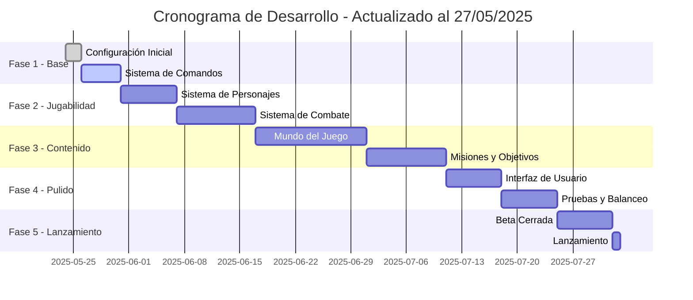

# 🏗️ Estructura de Creación del Bot: PassQuirk RPG

## 📊 Estado Actual del Proyecto

### ✅ Completado
- Configuración inicial del proyecto Node.js
- Estructura de carpetas básica
- Sistema de comandos base
- Integración con MongoDB
- Sistema de gestión de estados del juego
- Manejador de interacciones avanzado
- Sistema de estilos para mensajes embebidos

### 🚧 En Progreso
- Sistema de combate por turnos
- Sistema de inventario
- Interfaz de usuario interactiva

### 📅 Próximos Pasos
1. Completar el sistema de combate
2. Implementar el sistema de misiones
3. Desarrollar la interfaz de usuario
4. Crear contenido del juego (NPCs, objetos, etc.)

---

## 📋 Fase 1: Configuración Inicial (Completado ✅)
✅ **Proyecto Node.js** creado e inicializado
✅ **TypeScript** configurado
✅ **Dependencias principales** instaladas:
  - discord.js
  - mongoose
  - dotenv
  - winston (logging)
  - chalk (colores en consola)
  - date-fns (manejo de fechas)

✅ **Archivo .env** configurado con:
  - Token del bot
  - MongoDB URI
  - Prefijos y configuraciones

✅ **Estructura de carpetas implementada**:
```
PassQuirk/
├── bot/
│   ├── commands/         # Comandos de barra
│   │   ├── economy/      # Comandos de economía
│   │   └── ...
│   ├── events/          # Eventos de Discord
│   ├── models/           # Modelos de MongoDB
│   │   ├── User.js       # Modelo de usuario
│   │   └── ...
│   └── utils/           # Utilidades
│       ├── embedStyles.js  # Estilos de embeds
│       ├── gameStateManager.js  # Gestor de estados
│       └── interactionManager.js  # Manejador de interacciones
├── web/                  # Interfaz web
└── .env                  # Variables de entorno
```

## 🎮 Fase 2: Sistema de Comandos (En progreso 🚧)

### ✅ Completado
- Sistema de comandos base implementado
- Manejador de interacciones avanzado
- Sistema de menús contextuales
- Comandos de ayuda básicos

### 🚧 En Progreso
- Comandos de economía:
  - `/work` - Trabajar para ganar dinero
  - `/shop` - Ver tienda
  - `/inventory` - Ver inventario
  - `/buy` - Comprar ítems
  - `/pay` - Enviar dinero a otros jugadores
  - `/transactions` - Historial de transacciones
  - `/daily` - Recompensa diaria

### 📅 Próximos Pasos
1. Completar el sistema de economía
2. Implementar sistema de logros
3. Mejorar el sistema de ayuda

## 👤 Fase 3: Sistema de Personajes (Próximamente ⏳)

### 📋 Planificación
1. **Creación de Personaje**
   - Nombre y apariencia
   - Selección de clase (Guerrero, Mago, Ladrón, etc.)
   - Elección de región inicial
   - Trasfondo personalizable

2. **Sistema de Estadísticas**
   - Atributos base (Fuerza, Destreza, Inteligencia, etc.)
   - Niveles y experiencia
   - Habilidades especiales

3. **Progresión**
   - Sistema de niveles
   - Árbol de habilidades
   - Equipamiento y mejoras

### 🛠️ Para CIOMAFF
- Definir las clases y sus habilidades únicas
- Crear el sistema de progresión
- Diseñar las interfaces de creación de personaje

## ⚔️ Fase 4: Sistema de Combate (En desarrollo 🚧)

### 🏗️ Estructura Actual
```javascript
// Ejemplo de estructura de combate
class CombatSystem {
  constructor(players, enemies) {
    this.turnOrder = [];
    this.currentTurn = 0;
    this.state = 'active'; // active, finished, fled
    this.log = [];
  }
  
  async start() {
    // Inicializar combate
  }
  
  async nextTurn() {
    // Pasar al siguiente turno
  }
  
  async processAction(action) {
    // Procesar acción del jugador/enemigo
  }
}
```

### 📋 Características Planeadas
- Combate por turnos táctico
- Sistema de puntos de acción
- Efectos de estado (veneno, aturdimiento, etc.)
- Habilidades especiales por clase
- Recompensas de combate

### 🛠️ Para CIOMAFF
- Diseñar las mecánicas de combate
- Crear habilidades y efectos
- Balancear la dificultad

## 🌍 Fase 5: Mundo del Juego
- [ ] Implementar regiones iniciales
- [ ] Sistema de viaje
- [ ] NPCs interactivos
- [ ] Misiones principales

## 🎨 Fase 6: Interfaz y Experiencia de Usuario
- [ ] Embeds personalizados
- [ ] Sistema de menús
- [ ] Feedback visual
- [ ] Efectos de sonido

## 🔄 Fase 7: Características Avanzadas
- [ ] Sistema de gremios
- [ ] Comercio entre jugadores
- [ ] Eventos especiales
- [ ] Logros

## 🧪 Fase 8: Pruebas y Optimización
- [ ] Pruebas unitarias
- [ ] Pruebas de estrés
- [ ] Optimización de rendimiento
- [ ] Corrección de bugs

## 🚀 Fase 9: Despliegue
- [ ] Configuración de hosting
- [ ] Sistema de respaldos
- [ ] Monitoreo
- [ ] Actualizaciones automáticas

## 📚 Documentación
- [ ] Guía de instalación
- [ ] Manual de usuario
- [ ] API Reference
- [ ] Guía de contribución

## 📅 Cronograma de Desarrollo (Actualizado)



## 📋 Tareas para CIOMAFF

### 📝 Contenido
- [ ] Escribir la historia principal
- [ ] Crear diálogos para NPCs
- [ ] Diseñar misiones secundarias
- [ ] Escribir descripciones de objetos

### 🎨 Diseño
- [ ] Crear sprites de personajes
- [ ] Diseñar fondos de batalla
- [ ] Crear iconos de habilidades
- [ ] Diseñar la interfaz de usuario

### ⚖️ Balance
- [ ] Probar el sistema de combate
- [ ] Ajustar la economía del juego
- [ ] Balancear la dificultad
- [ ] Probar la progresión de personaje

## 📂 Estructura de Archivos Actualizada
```
PassQuirk/
├── bot/
│   ├── commands/           # Comandos de barra
│   │   ├── economy/        # Comandos de economía
│   │   └── ...
│   ├── events/            # Eventos de Discord
│   ├── models/             # Modelos de MongoDB
│   │   ├── User.js         # Modelo de usuario
│   │   └── ...
│   └── utils/             # Utilidades
│       ├── embedStyles.js    # Estilos de embeds
│       ├── gameStateManager.js  # Gestor de estados
│       └── interactionManager.js  # Manejador de interacciones
├── web/                    # Interfaz web
├── .env                    # Variables de entorno
└── package.json            # Dependencias
```

## 📂 Estructura de Archivos Detallada
```
PassQuirk/
├── src/
│   ├── commands/         # Comandos de barra
│   ├── events/           # Eventos de Discord
│   ├── interactions/     # Manejo de interacciones
│   ├── models/           # Modelos de datos
│   │   ├── Character.ts
│   │   ├── Inventory.ts
│   │   └── ...
│   ├── utils/           # Utilidades
│   ├── assets/           # Recursos
│   │   ├── images/       # Sprites, fondos, etc.
│   │   └── data/         # Datos del juego
│   ├── config.ts         # Configuración
│   └── index.ts          # Punto de entrada
├── .env                  # Variables de entorno
├── package.json
├── tsconfig.json
└── README.md
```

## 🚀 Próximos Pasos Inmediatos

### 1. Completar Sistema de Economía (Semana 1)
- [ ] Implementar tienda con categorías
- [ ] Crear sistema de trabajos
- [ ] Añadir recompensas diarias
- [ ] Implementar sistema de apuestas

### 2. Sistema de Combate (Semana 2-3)
- [ ] Terminar mecánica de turnos
- [ ] Implementar habilidades básicas
- [ ] Crear enemigos de prueba
- [ ] Sistema de recompensas de combate

### 3. Interfaz de Usuario (Semana 3-4)
- [ ] Diseñar menús interactivos
- [ ] Crear sistema de notificaciones
- [ ] Implementar barras de progreso
- [ ] Añadir efectos visuales

### 4. Contenido del Juego (Semana 4-6)
- [ ] Crear NPCs y diálogos
- [ ] Diseñar misiones principales
- [ ] Implementar sistema de logros
- [ ] Crear eventos especiales

---

## 📅 Próxima Reunión
**Fecha:** 30/05/2025  
**Hora:** 18:00 (CEST)  
**Temas a tratar:**
1. Revisión del sistema de economía
2. Demo del sistema de combate
3. Próximos pasos

¿Neitas que te ayude con algo más?
